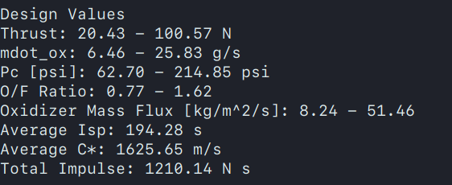

# Temporal performance analysis
## Usage

To use the code, use
```bash
python time_analysis.py <input_file_name>
```
By default, the code will look for `input.ini`. Instructions on what to provide to the input file are written as comments and should be self-explanatory.

To modify the `mdot_ox` profile, change the implementation of `get_desired_mdot_ox` in `time_analysis.py`.

The code uses python 3. I don't remember what packages I installed myself. If you want to work in the same environment as me, start with a fresh python 3 install (using `virtualenv` for instance) and do
```bash
pip install -r my_env.txt
```

## Inputs for Chosen Design Values

Inputs to arrive at the design values shown above:
```
# fuel density [kg/m3]
rho_fuel = 1180 
# ambient pressure [Pa]
p0 = 101325
# number of timesteps
n_timesteps = 1000
# throat radius [m]
throat_radius = 4e-3
# area ratio
area_ratio = 2.43
# burn time [s]
burn_time = 20

# grain length [in]
fuel_length = 18
# initial target chamber pressure [psi]
initial_pc = 213.5
# initial target O/F
initial_of = 1.625

# Flora's regression params
# a = 2.11e-5
# n = 0.615
# Rabinovitch regression params (Nonlinear fit)
# a = 8.96e-5
# n = 0.35
# Rabinovitch regression params (standard fit)
a = 5.82e-5
n = 0.47

# throttling factor (for up-down-up profile)
#throttling_factor = 4.5
throttling_factor = 4
```